<div align="center">
  <h1>Pawanda - AI Commerce Agent & E-Commerce Automation</h1>
  <p><strong>Next-Generation Autonomous WhatsApp Agent & Admin Dashboard</strong></p>

  <p align="center">
    
    
    
    
    
    
    
    
    
    
    
  </p>
</div>

<br />

## Table of Contents
- [About the Project](#-about-the-project)
- [How We Built It](#-how-we-built-it)
- [Use Cases & Applications](#-use-cases--applications)
- [Core Features](#-core-features)
- [System Architecture](#-system-architecture)
- [Gallery & Screenshots](#-gallery--screenshots)
- [Installation & Setup](#-installation--setup)
- [Author & Contact](#-author)

---

## 📖 About the Project

**Pawanda** is an enterprise-grade E-Commerce Automation platform designed to bridge the gap between businesses and consumers on WhatsApp. 

In traditional e-commerce, customer support and manual order processing scale poorly and suffer from high latency. **Pawanda solves this by introducing a highly intelligent, Google Gemini-backed AI agent** that acts as a fully autonomous salesperson on WhatsApp. The agent can chat with customers, showcase products from the dynamic catalog, negotiate prices securely within admin-defined boundaries, and finalize orders seamlessly. 

The entire operation is visible to administrators in real-time through a beautifully engineered, high-performance Dark Mode dashboard, ensuring complete control and insight over the automated business.

---

## 🛠 How We Built It

The platform was meticulously engineered using a modern, scalable technology stack:

- **Frontend (Client):** Built using **React.js (Vite)** and **TypeScript** for lightning-fast rendering and strict type safety. We implemented **Tailwind CSS** to create a premium, glassmorphism-inspired dark UI. For data visualization, we utilized **Recharts** to plot dynamic revenue and sales trends.
- **Backend (Server):** Powered by **Node.js** and **Express.js** providing a robust RESTful API. We utilized **Multer** to handle multipart form data for uploading heavy product assets, including high-resolution images, videos, and dynamic AI voice notes.
- **Database:** A highly optimized **MySQL** relational database schema ensures strict transactional integrity for Orders, Inventory, Pricing, and Analytics.
- **AI Integration:** The conversational engine is driven by the **Google Generative AI SDK**. We engineered a custom context-injection layer that feeds real-time database knowledge (Product Catalog, Minimum Prices, Store Policies) directly into the AI's prompt space, allowing it to negotiate like a real human while adhering to strict business rules.

---

## 🎯 Use Cases & Applications

Pawanda is designed to automate conversational commerce. It is the perfect solution for:
1. **Direct-to-Consumer (D2C) Brands:** Automating WhatsApp storefronts where customers prefer chatting over browsing a website.
2. **Wholesalers & B2B Businesses:** Allowing clients to negotiate bulk prices autonomously within pre-approved thresholds.
3. **Dropshipping Stores:** Managing large influxes of customer queries regarding product details, sizing, and delivery seamlessly without human intervention.
4. **Local Commerce & Thrifting:** Managing dynamic pricing environments where bargaining and price negotiation are culturally expected.

---

## ⚡ Core Features

<table>
  <tr>
    <td width="5%"></td>
    <td><strong>Autonomous AI WhatsApp Agent:</strong> A fully integrated AI capable of conversational commerce, contextual understanding, and answering complex product inquiries.</td>
  </tr>
  <tr>
    <td width="5%"></td>
    <td><strong>Live Conversation Monitoring:</strong> Real-time dashboard view of active AI-customer WhatsApp threads with manual override capabilities.</td>
  </tr>
  <tr>
    <td width="5%"></td>
    <td><strong>Dynamic Pricing & Negotiation:</strong> Define "Starting Prices" and "Minimum Negotiable Thresholds". The AI intelligently negotiates with customers to maximize profit while securing the sale.</td>
  </tr>
  <tr>
    <td width="5%"></td>
    <td><strong>Advanced Product Catalog:</strong> Support for rich media uploads including multiple images, product videos, and predefined AI Voice Notes to send to customers.</td>
  </tr>
  <tr>
    <td width="5%"></td>
    <td><strong>Order & Invoice Management:</strong> Professional order processing with dynamic invoice generation (calculating Original Catalog Price, AI-Negotiated Discount, and Delivery Fees).</td>
  </tr>
  <tr>
    <td width="5%"></td>
    <td><strong>Granular Analytics & Insights:</strong> KPI tracking, sales trends, top-selling products, and AI performance metrics powered by interactive Recharts.</td>
  </tr>
  <tr>
    <td width="5%"></td>
    <td><strong>AI Customization & Policies:</strong> Define exact business rules, prompt injections, and predefined voice profiles to strictly control the agent's personality and boundaries.</td>
  </tr>
</table>

---

## 📸 Gallery & Screenshots

<div align="center">
  <table width="100%" align="center">
    <tr>
      <td colspan="2">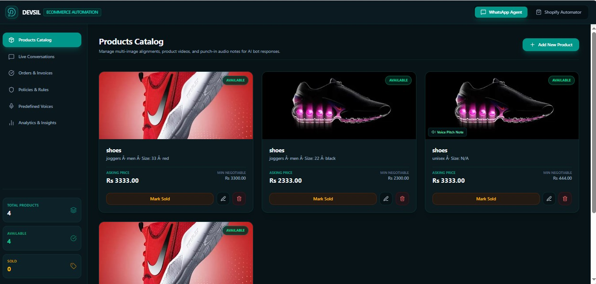</td>
    </tr>
    <tr>
      <td width="50%">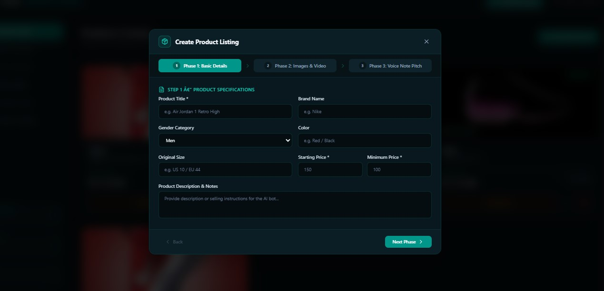</td>
      <td width="50%">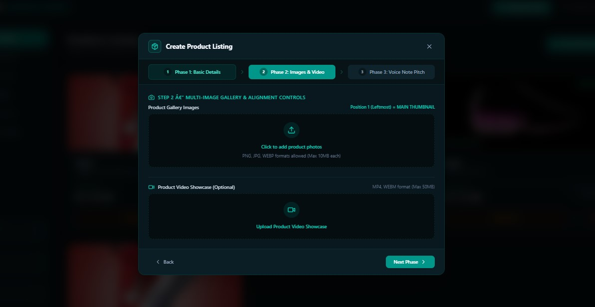</td>
    </tr>
    <tr>
      <td width="50%">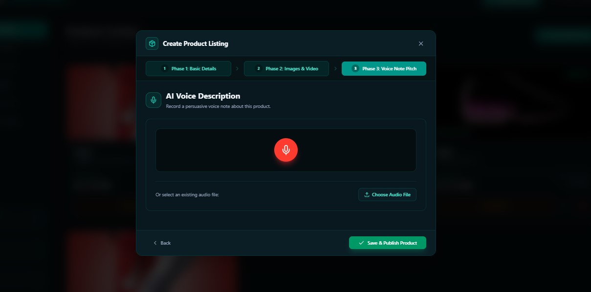</td>
      <td width="50%">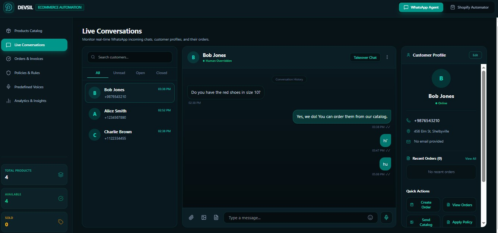</td>
    </tr>
    <tr>
      <td width="50%">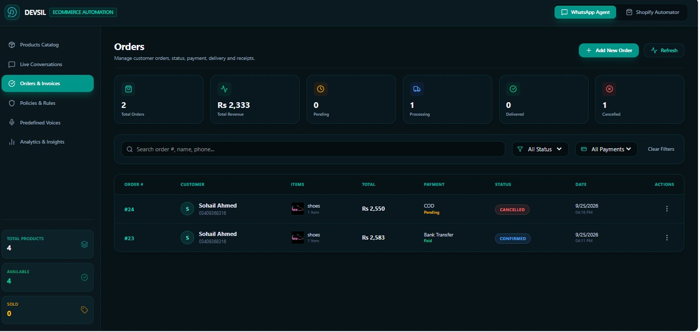</td>
      <td width="50%">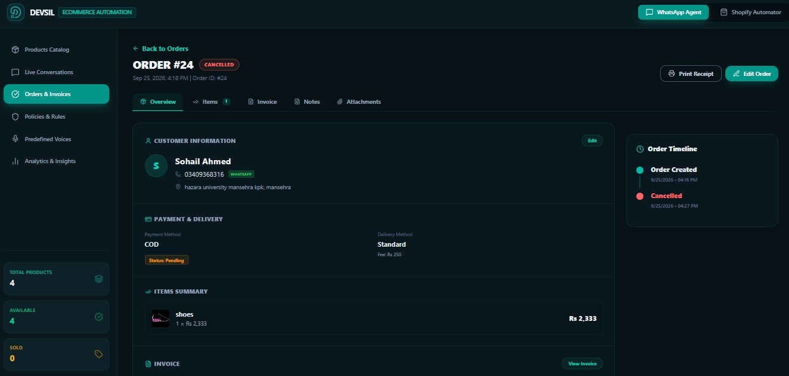</td>
    </tr>
    <tr>
      <td width="50%">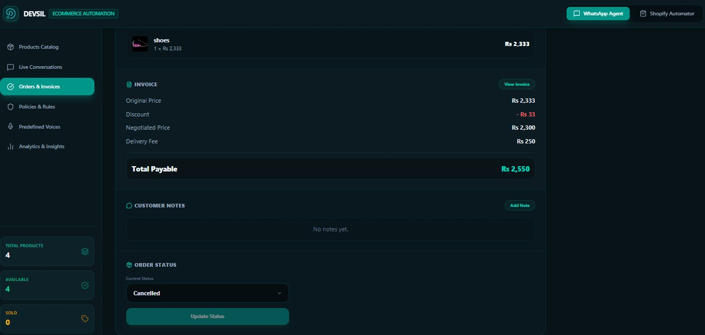</td>
      <td width="50%">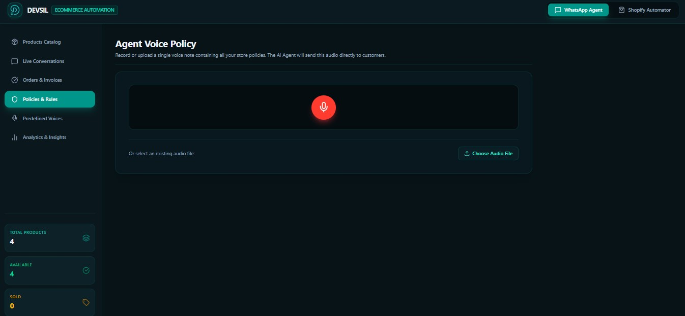</td>
    </tr>
    <tr>
      <td width="50%">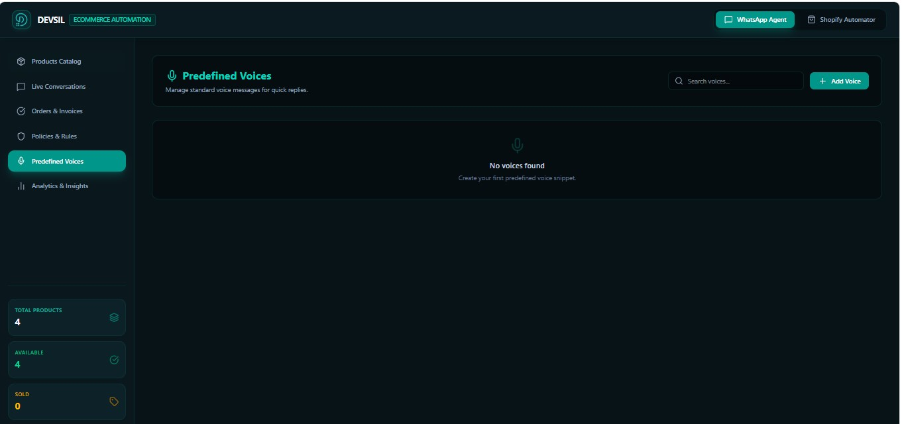</td>
      <td width="50%">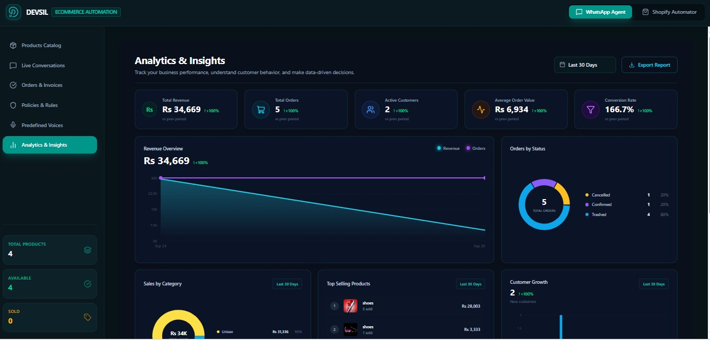</td>
    </tr>
    <tr>
      <td colspan="2">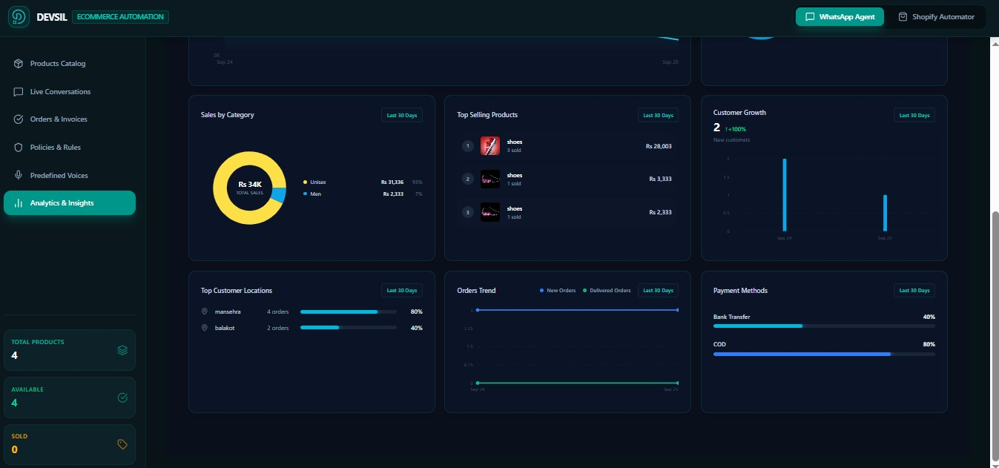</td>
    </tr>
  </table>
</div>

---

## 🚀 Installation & Setup

### Prerequisites
- Node.js (v18+)
- MySQL Server (XAMPP or standalone)
- Google Gemini API Key

### Local Development Setup

1. **Clone the repository:**
   ```bash
   git clone https://github.com/sohail-ahmed-26/ecomerce-automation.git
   cd ecomerce-automation
   ```

2. **Setup the Backend:**
   ```bash
   cd backend
   npm install
   
   # Add your environment variables in backend/.env
   # DB_HOST, DB_USER, DB_PASSWORD, GEMINI_API_KEY
   
   node setupDb.js # Run initial database migrations
   npm start # Starts server on port 3000
   ```

3. **Setup the Frontend:**
   ```bash
   cd ../frontend
   npm install
   npm run dev # Starts Vite server on port 5173
   ```

---

## 👨‍💻 Author

<div align="center">
  <a href="https://sohail.devsil.com">
    
  </a>
  <br />
  <h3><b>Sohail Ahmed</b></h3>
  <p><i>AI Engineer & Data Scientist</i></p>
  
  <p align="center">
    <a href="https://sohail.devsil.com">
      
    </a>
    &nbsp;&nbsp;
    <a href="https://github.com/sohail-ahmed-26">
      
    </a>
    &nbsp;&nbsp;
    <a href="https://linkedin.com/in/sohail-ahmed-26">
      
    </a>
  </p>
</div>

*Building intelligent AI systems that solve real-world problems through data, automation, and innovation. Pawanda is a testament to blending complex automated workflows with a premium UI experience.*

---

<div align="center">
  <p><i>If you found this project inspiring, please consider giving it a ⭐ on GitHub!</i></p>
</div>
